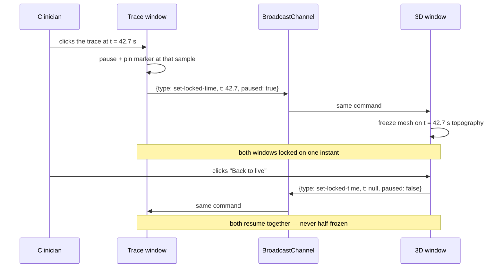
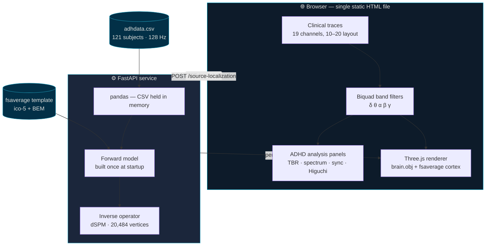
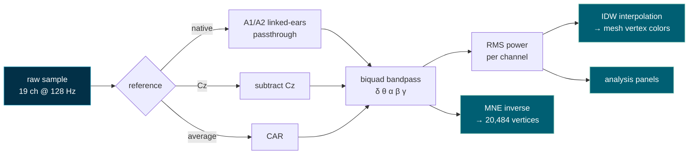

<div align="center">

# EEG Brain 3D

### An open, inspectable workbench for exploring ADHD EEG recordings in three dimensions

**19 channels · 10–20 montage · 128 Hz · real cortical source reconstruction**

[](https://mne.tools)
[](https://fastapi.tiangolo.com)
[](https://threejs.org)
[](https://python.org)
[](#license)


</div>

---

## Why this exists

A clinician reading an EEG spends most of the session looking at nineteen parallel ink traces. The information is all there — but the *geography* is not. Which region is driving that theta burst? Is the frontal midline slowing bilateral, or is one hemisphere leading? A trace plot answers those questions only in the reader's head, through years of trained spatial imagination.

This project puts the geography back on the screen. It takes a real 19-channel recording, streams it in clinical layout, and simultaneously paints the measured band power onto an anatomical 3D brain — so the spatial story and the temporal story are visible at the same instant, side by side.

It is built around a public dataset of **121 children (61 with ADHD, 60 controls)** performing a visual attention task, and it surfaces the quantitative markers the ADHD-EEG literature actually discusses: theta/beta ratio, multi-band spectral profile, inter-channel synchronization, and signal complexity.

> [!IMPORTANT]
> **This is a research and educational tool, not a medical device.** It produces *descriptive* measurements, never a diagnosis. See [Limitations](#limitations-read-this-part) before drawing any conclusion from what it displays — that section is the most important one in this document.

---

## What you can do with it

| | |
|---|---|
| 🧠 **See power as anatomy** | Band power from all 19 electrodes is interpolated across a real brain mesh, updating live as the recording plays |
| 🔬 **Reconstruct cortical sources** | A full MNE-Python forward/inverse pipeline estimates activity across **20,484 cortical vertices** — not electrode interpolation, but a geometrically grounded source estimate |
| ⏸️ **Freeze an instant and study it** | Click any point in the trace to lock time; the 3D brain freezes on that exact sample ([details below](#the-time-lock-click-a-moment-study-it)) |
| 📊 **Read the ADHD markers** | Four descriptive panels — TBR, spectral profile, synchronization matrix, Higuchi fractal dimension |
| 🔀 **Re-reference on the fly** | Switch between native linked-ears (A1/A2), Cz, and common average reference (CAR) and watch the topography change |
| 🎚️ **Isolate a rhythm** | Filter to delta, theta, alpha, beta, or gamma with real biquad filters and see only that band's spatial distribution |

---

## The time-lock: click a moment, study it

This is the feature that turns the dashboard from an animation into an instrument.

While the recording streams, the 3D brain is a moving picture — informative, but hard to interrogate. **Click anywhere on the clinical trace and time stops.** The exact sample under your cursor becomes the analysis point: the signal pauses, a white marker pins the instant on the trace, and the 3D brain freezes on that sample's topography. The header confirms what you're looking at — `Analyzing t=42.7s (paused)`.


Both windows stay in lockstep. The trace window and the 3D window talk to each other over a `BroadcastChannel`, so locking in one freezes the other, and **Back to live** releases both together — the view can never end up half-frozen without you noticing.



Why it matters: a suspicious burst lasts a fraction of a second. Time-lock lets you stop *on* it, then switch bands, change the reference, or run a source reconstruction — all against that one frozen moment, instead of chasing it across a moving screen.

---

## Cortical source reconstruction

The sensor view answers *"where was the signal strongest on the scalp?"* — which is not the same question as *"where in the brain did it come from?"* Scalp potentials are a blurred, volume-conducted shadow of cortical activity.

The **Cortical sources (MNE)** tab estimates the underlying generators properly. Pick a subject and a time window, click **Run reconstruction**, and the backend solves the inverse problem over the fsaverage template cortex, returning one activation value per vertex.


Under the hood, via [MNE-Python](https://mne.tools):

| Stage | Implementation |
|---|---|
| Head model | `fsaverage` template, ico-5 surface source space (20,484 vertices) |
| Boundary elements | 3-layer BEM (`fsaverage-5120-5120-5120`) |
| Electrode positions | `standard_1020` montage, 19 channels |
| Forward solution | `make_forward_solution()` — EEG only |
| Noise covariance | `make_ad_hoc_cov()` — diagonal, no empty-room recording available |
| Inverse operator | `make_inverse_operator(loose=0.2, depth=0.8)` |
| Estimator | dSPM (default), λ² = 1/9 |
| Reference | Common average, applied as a projector on both sides of the pipeline |

The forward and inverse operators are built **once at server startup** and held in memory — reconstruction requests then cost a single matrix application rather than minutes of setup.

---

## The ADHD analysis panels

Four descriptive panels, computed live over the visible buffer. Each carries its own caveat in the interface, because each one deserves one.

<table>
<tr>
<td width="50%">


**Theta/Beta Ratio (TBR)** — the classic ADHD marker, per channel. Once FDA-cleared as a diagnostic aid, later walked back: sensitivity in the literature spans a disappointing 38–63%, and it is not reliable in isolation.

</td>
<td width="50%">


**Synchronization + complexity** — a channel-by-channel correlation matrix for the active band, and Higuchi fractal dimension as a measure of signal complexity (EEG typically lands between ~1.0 and ~2.0).

</td>
</tr>
</table>

Also included: a **5-band spectral profile** (RMS power per band per channel, normalized within each channel).

The panels follow the markers reviewed in *Use of EEG to Diagnose ADHD* ([PMC4633088](https://pmc.ncbi.nlm.nih.gov/articles/PMC4633088/)). The ERP components from that review (P3, N2, ERN, P2, FRN) are deliberately **absent** — they require stimulus-event markers in the time series, and this dataset ships no event column. Rather than fake them, the app omits them.

---

## Architecture

A deliberately small system: one static HTML file for everything interactive, one Python service for the heavy neuroscience.



### Signal path, from CSV row to colored vertex



Note the two distinct routes to the 3D view. The **sensor** path (`IDW interpolation`) spreads electrode measurements across the mesh — fast, live, but anatomically naive. The **source** path (`MNE inverse`) solves the physics — slower, snapshot-only, but geometrically meaningful. The app keeps them clearly separate and labels which one you are looking at, because conflating the two is exactly how EEG visualizations mislead.

---

## Getting started

### Requirements

- Python 3.11+
- A modern browser with WebGL
- ~2 GB free disk (the fsaverage template downloads on first run)

### 1. Get the data

`adhdata.csv` is **not in this repository** — it is 255 MB, well past GitHub's file limit. Download it yourself:

> **EEG Data for ADHD / Control Children** — Nasrabadi, Allahverdy, Samavati & Mohammadi (2020)
> [IEEE DataPort](https://ieee-dataport.org/open-access/eeg-data-adhd-control-children) · DOI [10.21227/rzfh-zn36](https://doi.org/10.21227/rzfh-zn36) · also mirrored on [Kaggle](https://www.kaggle.com/datasets/danizo/eeg-dataset-for-adhd/data)

Place `adhdata.csv` in the repository root. Expected columns: the 19 channel names, plus `Class` (`ADHD` / `Control`) and `ID`.

<details>
<summary>A note on channel naming</summary>

The original dataset uses the older labels `T3/T4/T5/T6`. This project uses the modern equivalents `T7/T8/P7/P8` throughout, matching the `standard_1020` montage in MNE. They refer to the same electrode positions.

</details>

### 2. Start the backend

```bash
cd backend
pip install -r requirements.txt
python -m uvicorn app:app --port 8000
```

First startup takes a few minutes: it downloads the fsaverage template and builds the forward and inverse operators. Subsequent runs are fast — everything is cached. Wait for:

```
[startup] forward/inverse prontos: 20484 vértices, 19 canais
```

### 3. Serve the frontend

```bash
python -m http.server 5500
```

Open <http://localhost:5500/eeg-cerebro-3d.html>.

> The backend only accepts requests from `localhost` / `127.0.0.1`. Open the page through the HTTP server — not as a `file://` URL — or the browser will block the calls.

<details>
<summary>Running the tests</summary>

```bash
cd backend
python -m pytest tests/
```

</details>

---

## API

| Endpoint | Method | Purpose |
|---|---|---|
| `/subjects` | `GET` | Every subject with class label and recording duration |
| `/raw-data?subject_id=<id>` | `GET` | Full recording for one subject, per channel |
| `/source-localization` | `POST` | Source reconstruction for a time window |

```jsonc
// POST /source-localization
{ "subject_id": "v10p", "t_start": 0.0, "t_end": 2.0, "method": "dSPM" }

// → 200
{ "values": [/* one per vertex */], "n_vertices": 20484, "time": 0.0, "method": "dSPM" }
```

---

## Limitations (read this part)

Honesty about what a tool *cannot* do is what makes it usable in a scientific context. These caveats appear inside the interface too, next to the numbers they qualify — not buried in a document nobody opens.

**Nineteen channels is few for source localization.** Research-grade source reconstruction uses 64, 128, or 256 electrodes. With 19, the inverse problem is severely underdetermined: the output is a plausible smooth estimate, not the true origin of the signal. Treat a hotspot as a *region of interest*, never as a coordinate.

**fsaverage is a template brain.** Every reconstruction is projected onto an average anatomy, not the individual child's. Without that subject's MRI, per-subject anatomical accuracy is simply unavailable.

**The literature thresholds do not transfer.** Published TBR cutoffs come from **resting-state** EEG. This dataset was recorded during an active visual attention task (children counting cartoon characters). Comparing these numbers against resting-state thresholds is an apples-to-oranges error.

**The synchronization matrix is a correlation, not coherence.** It correlates band-filtered signals in the time domain. That is a useful, cheap proxy — but it is not magnitude-squared coherence, and should not be reported as such.

**No artifact rejection.** Eye blinks, muscle tension, and electrode drift are all still in the signal. Serious analysis needs ICA-based cleaning first.

**Ad-hoc noise covariance.** With no empty-room or baseline recording in the dataset, the inverse operator uses a diagonal ad-hoc covariance — a reasonable default, and a real approximation.

> [!WARNING]
> **Not a diagnostic instrument.** ADHD is a clinical diagnosis made by a qualified professional through history, observation, and validated instruments. EEG is not a standalone diagnostic test for it, and no number this software displays should be presented to a patient or family as evidence of a diagnosis.

---

## Acknowledgments

This project is built on the work of people who gave their tools away, and it would not exist otherwise.

**[MNE-Python](https://mne.tools)** — the entire source reconstruction pipeline is theirs: forward modeling, BEM handling, the inverse operators, and the fsaverage template that ships ready to use without a FreeSurfer installation. It is a remarkable piece of open scientific software, and the reason a project this small can do real source analysis at all. Deep thanks to its maintainers and contributors.

**Nasrabadi, Allahverdy, Samavati & Mohammadi** — for publishing their ADHD/control EEG recordings as open access. Public datasets are what make independent work like this possible.

**[Three.js](https://threejs.org)**, **[FastAPI](https://fastapi.tiangolo.com)**, **[pandas](https://pandas.pydata.org)**, and **[NumPy](https://numpy.org)** — the rest of the foundation.

### Citing the tools

If this work contributes to something you publish, please cite MNE-Python and the dataset:

```bibtex
@article{gramfort2013mne,
  title   = {MEG and EEG data analysis with MNE-Python},
  author  = {Gramfort, Alexandre and Luessi, Martin and Larson, Eric and
             Engemann, Denis A. and Strohmeier, Daniel and Brodbeck, Christian and
             Goj, Roman and Jas, Mainak and Brooks, Teon and Parkkonen, Lauri and
             H{\"a}m{\"a}l{\"a}inen, Matti},
  journal = {Frontiers in Neuroscience},
  volume  = {7},
  pages   = {267},
  year    = {2013},
  doi     = {10.3389/fnins.2013.00267}
}

@data{nasrabadi2020eeg,
  title     = {EEG data for ADHD / Control children},
  author    = {Nasrabadi, Ali Motie and Allahverdy, Armin and
               Samavati, Mehdi and Mohammadi, Mohammad Reza},
  publisher = {IEEE Dataport},
  year      = {2020},
  doi       = {10.21227/rzfh-zn36}
}
```

---

## Repository

**<https://github.com/murilomn58/EEG_app>**

Issues and pull requests are welcome — particularly around artifact rejection, additional inverse methods (sLORETA, eLORETA), and per-band source reconstruction.

<details>
<summary>Project layout</summary>

```
├── eeg-cerebro-3d.html      # the entire frontend — one self-contained file
├── backend/
│   ├── app.py               # FastAPI routes + startup lifecycle
│   ├── csv_data.py          # dataset loading and time-window slicing
│   ├── mne_setup.py         # forward model + inverse operator
│   ├── mne_infer.py         # applies the inverse solution
│   └── tests/               # pytest suite
├── assets/                  # brain.obj + fsaverage cortex mesh
├── docs/                    # design notes, implementation plan, images
└── legacy/                  # earlier dipole prototype
```

</details>

> **Interface language:** the UI is in Brazilian Portuguese. The codebase and this documentation are in English.

---

## License

MIT — see [LICENSE](LICENSE).

The dataset is **not** covered by this license; it carries its own terms from IEEE DataPort.

<div align="center">
<br>
<sub>Built for clinicians, researchers, and students who want to <i>see</i> the signal — not just read it.</sub>
</div>
