<div align="center">

# EEG Brain 3D

### An open, inspectable workbench for exploring ADHD EEG recordings in three dimensions

**19 channels · 10-20 montage · 128 Hz · real cortical source reconstruction**

[](https://mne.tools)
[](https://fastapi.tiangolo.com)
[](https://threejs.org)
[](https://python.org)
[](#license)

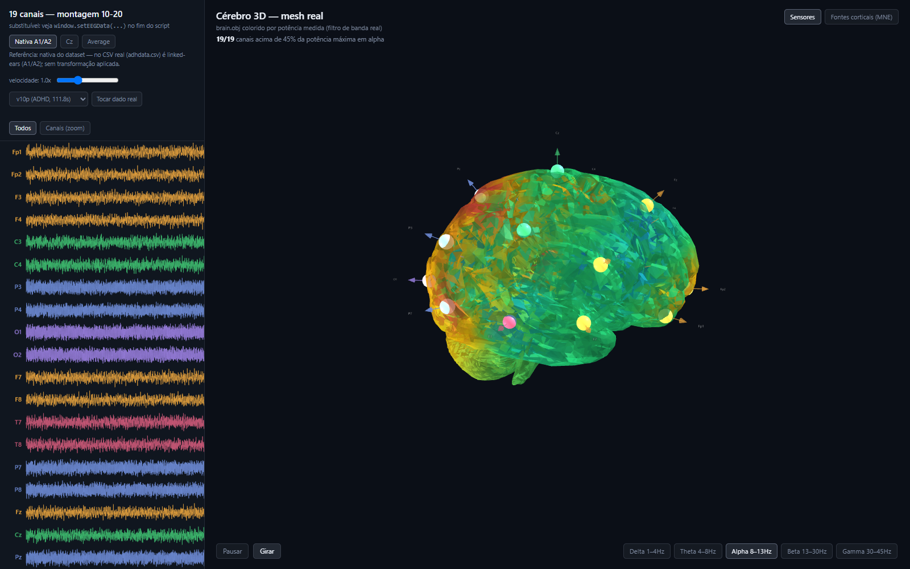

</div>

---

## Why this exists

A clinician reading an EEG spends most of the session looking at nineteen parallel ink traces. The information is all there. but the *geography* is not. Which region is driving that theta burst? Is the frontal midline slowing bilateral, or is one hemisphere leading? A trace plot answers those questions only in the reader's head, through years of trained spatial imagination.

This project puts the geography back on the screen. It takes a real 19-channel recording, streams it in clinical layout, and simultaneously paints the measured band power onto an anatomical 3D brain. so the spatial story and the temporal story are visible at the same instant, side by side.

It is built around a public dataset of **121 children (61 with ADHD, 60 controls)** performing a visual attention task, and it surfaces the quantitative markers the ADHD-EEG literature actually discusses: theta/beta ratio, multi-band spectral profile, inter-channel synchronization, and signal complexity.

> [!IMPORTANT]
> **This is a research and educational tool, not a medical device.** It produces *descriptive* measurements, never a diagnosis. See [Limitations](#limitations-read-this-part) before drawing any conclusion from what it displays. that section is the most important one in this document.

---

## What you can do with it

| | |
|---|---|
| 🧠 **See power as anatomy** | Band power from all 19 electrodes is interpolated across a real brain mesh, updating live as the recording plays |
| 🔬 **Reconstruct cortical sources** | A full MNE-Python forward/inverse pipeline estimates activity across **20,484 cortical vertices**. not electrode interpolation, but a geometrically grounded source estimate |
| ⏸️ **Freeze an instant and study it** | Click any point in the trace to lock time; the 3D brain freezes on that exact sample ([details below](#the-time-lock-click-a-moment-study-it)) |
| ⏭️ **Jump anywhere in the recording** | Seek to any second instantly, or let it find the next global event for you ([details below](#navigating-the-recording)) |
| 📊 **Read the ADHD markers** | Four descriptive panels. TBR, spectral profile, synchronization matrix, Higuchi fractal dimension |
| 🔀 **Re-reference on the fly** | Switch between native linked-ears (A1/A2), Cz, and common average reference (CAR) and watch the topography change |
| 🎚️ **Isolate a rhythm** | Filter to delta, theta, alpha, beta, or gamma with real biquad filters and see only that band's spatial distribution |

---

## The time-lock: click a moment, study it

This is the feature that turns the dashboard from an animation into an instrument.

While the recording streams, the 3D brain is a moving picture. informative, but hard to interrogate. **Click anywhere on the clinical trace and time stops.** The exact sample under your cursor becomes the analysis point: the signal pauses, a white marker pins the instant on the trace, and the 3D brain freezes on that sample's topography. The header confirms what you're looking at. `Analyzing t=42.7s (paused)`.

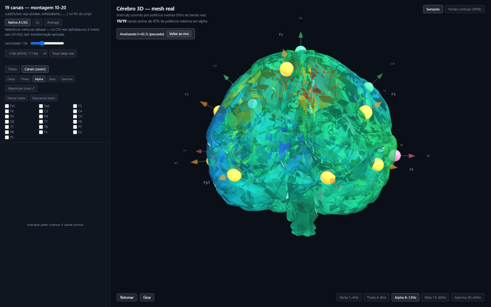

Both windows stay in lockstep. The trace window and the 3D window talk to each other over a `BroadcastChannel`, so locking in one freezes the other, and **Back to live** releases both together. the view can never end up half-frozen without you noticing.

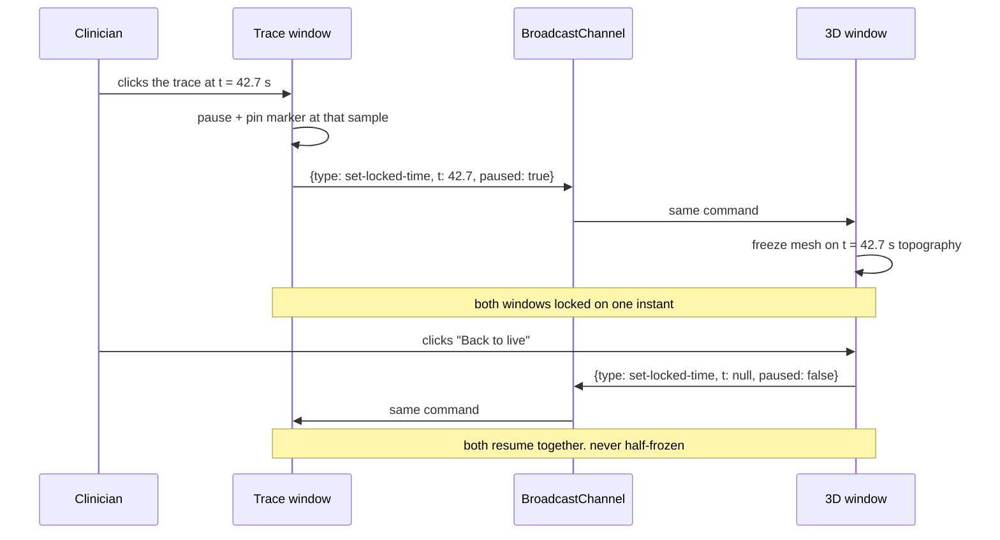

Why it matters: a suspicious burst lasts a fraction of a second. Time-lock lets you stop *on* it, then switch bands, change the reference, or run a source reconstruction. all against that one frozen moment, instead of chasing it across a moving screen.

---

## Navigating the recording

Time-lock answers *"what is happening right now?"*. but a 155-second recording has one moment you care about and 154 seconds you don't. Waiting for playback to reach it is not analysis, it's patience.

The **position controls** in the maximized signal window let you jump anywhere in the series instantly: drag the slider, or type the exact second and press **Ir para**. No reload, no new request. the full recording is already in memory from `/raw-data`, and the signal source is a pure function of time, so seeking is just moving the origin.

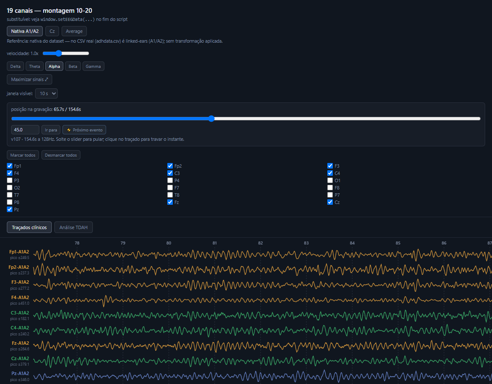

### Finding what matters: ⚡ Próximo evento

The button beside the field scans the whole recording for **global events**. instants where many channels deviate simultaneously. and jumps to the next one, entering 1.5 s early so you see it arrive rather than land mid-event.

Detection uses a robust z-score per channel (median/MAD, so a large artifact cannot inflate the deviation that would reveal it) and flags samples where at least 12 of 19 channels exceed 5σ at once. Scanning a 155-second recording takes about **47 ms** in the browser.

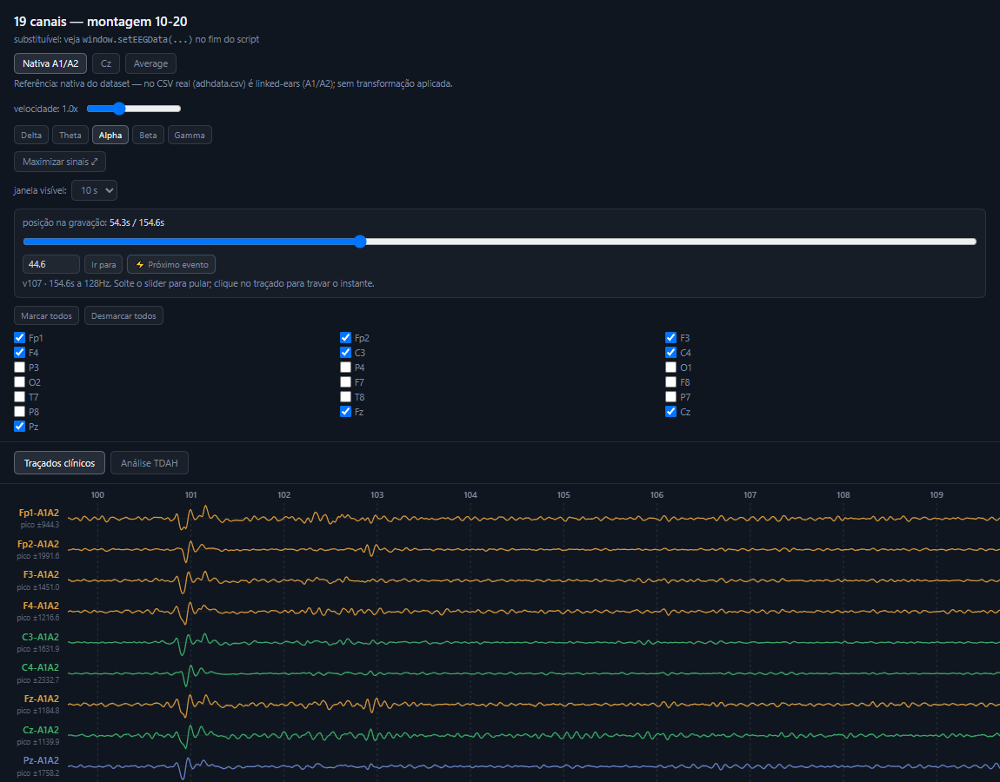

Above, subject `v107` at **t = 45.9 s**. every channel deflecting in the same direction at the same instant, ±944 to ±2332 µV. That is 20-30× the subject's typical amplitude, which tells you exactly what it is: **not neural activity**, but a movement or reference artifact. Genuine cortical activity is never that large and never that globally synchronized.

That is the honest use for this feature. It finds the moments that dominate your averages and distort your band power. so you can look at them, recognize them, and decide what to exclude.

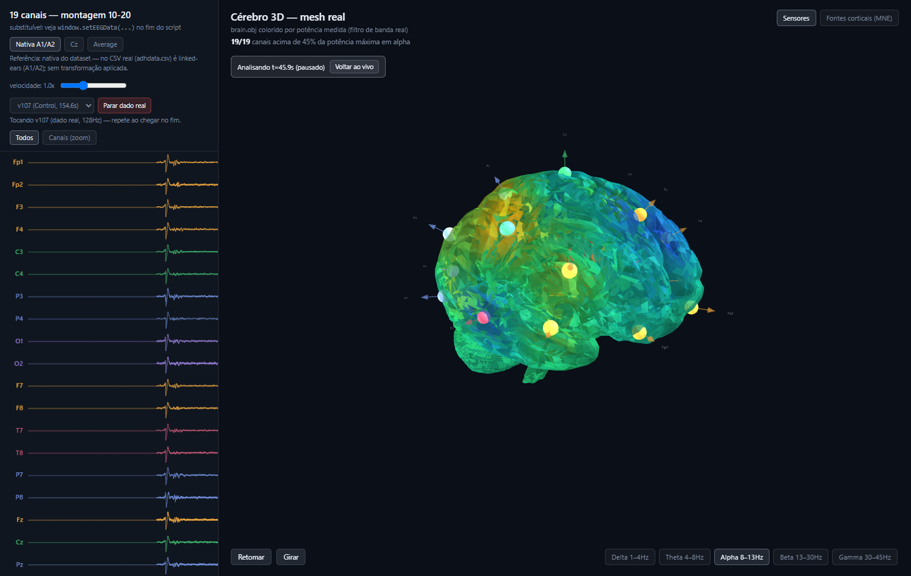

Combined with time-lock, you jump to the event, freeze on it, and watch the whole 3D brain light up at once. which is precisely the visual signature of an artifact rather than a focal source. A real cortical generator lights a region; a movement artifact lights everything.

## Cortical source reconstruction

The sensor view answers *"where was the signal strongest on the scalp?"*. which is not the same question as *"where in the brain did it come from?"* Scalp potentials are a blurred, volume-conducted shadow of cortical activity.

The **Cortical sources (MNE)** tab estimates the underlying generators properly. Pick a subject and a time window, click **Run reconstruction**, and the backend solves the inverse problem over the fsaverage template cortex, returning one activation value per vertex.

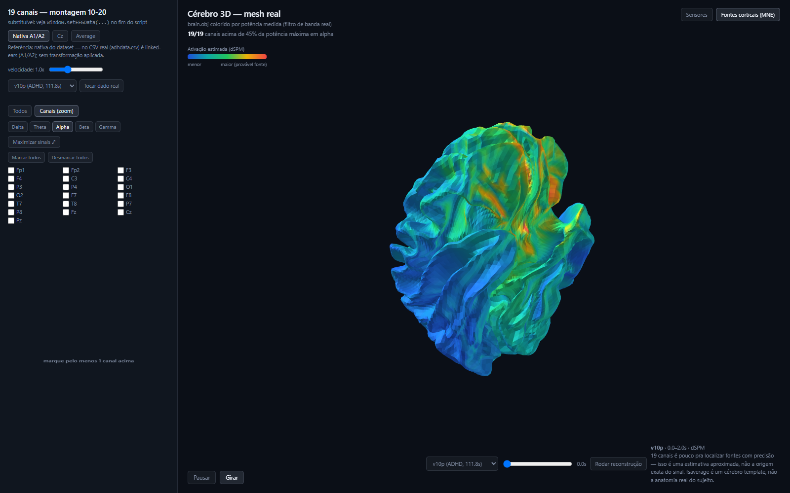

Under the hood, via [MNE-Python](https://mne.tools):

| Stage | Implementation |
|---|---|
| Head model | `fsaverage` template, ico-5 surface source space (20,484 vertices) |
| Boundary elements | 3-layer BEM (`fsaverage-5120-5120-5120`) |
| Electrode positions | `standard_1020` montage, 19 channels |
| Forward solution | `make_forward_solution()`. EEG only |
| Noise covariance | `make_ad_hoc_cov()`. diagonal, no empty-room recording available |
| Inverse operator | `make_inverse_operator(loose=0.2, depth=0.8)` |
| Estimator | dSPM (default), λ² = 1/9 |
| Reference | Common average, applied as a projector on both sides of the pipeline |

The forward and inverse operators are built **once at server startup** and held in memory. reconstruction requests then cost a single matrix application rather than minutes of setup.

---

## Raw or band-filtered. know which one you're reading

The trace view has a **Bruto** (raw) mode and one mode per band. The difference is not cosmetic, and confusing the two is an easy way to misread a recording.

<table>
<tr>
<td width="50%">

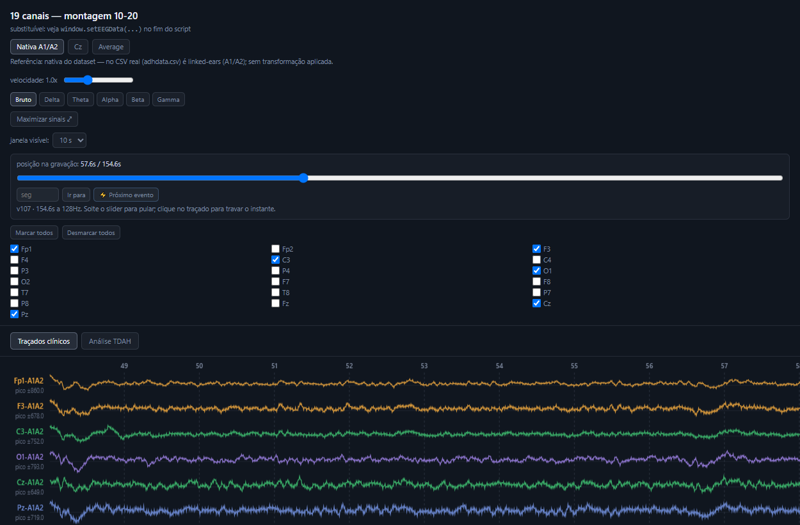

**Raw**. the signal as recorded, with only the reference applied. Irregular, drifting, ±650-860 µV here. This is what EEG actually looks like, and what you read clinically.

</td>
<td width="50%">

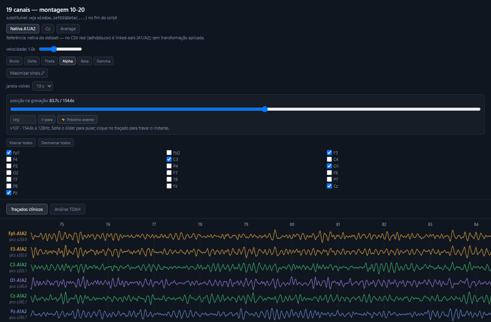

**Alpha (8-13 Hz)**. the same seconds through a narrow bandpass. Regular and rhythmic, ±223-393 µV. Useful for isolating one rhythm; misleading if read as "the patient's trace".

</td>
</tr>
</table>

A narrow bandpass makes *any* input look like a clean oscillation. that is what a bandpass does. If the traces ever look implausibly well-behaved, check which mode is selected, and whether you are on real data or the synthetic generator (whose amplitude is around ±0.5, not hundreds of µV).

Raw is the default for exactly this reason.

## Why the trace used to breathe

The signal view had two independent defects that read as one symptom: the traces pulsed, and sometimes froze.

**The pulsing was the vertical scale.** It was recomputed every frame from the largest excursion inside the visible window. The window slides about two samples per frame, so the moment a big artifact scrolled off the left edge the peak dropped in a step and every trace changed size at once. Worse, the value was drawn without removing the baseline, and the app's default is unfiltered signal with a +130 to +145 µV offset. so the peak was dominated by DC and the whole trace slid up and down inside its band.

Now the scale is measured **once**, when the recording loads, from the 95th percentile of each channel's absolute deviation over the entire record. The 95th percentile rather than the maximum: one eye blink is worth ten times the EEG, and scaling by it would flatten everything else for the rest of the session. Each channel label says which scale it is using. `±279.5 p95` for a measured one, `auto` for the damped fallback used on synthetic signal.

**The freezing was the clock.** The maximised signal window is a popup that generates nothing: it receives sample batches over `BroadcastChannel` from the main window, one message per frame. Its sliding window was anchored to the timestamp of the last sample that *arrived*. And the main window. sitting behind the popup, occluded. gets its `requestAnimationFrame` throttled by the browser, while a `Math.min(0.05, dt)` clamp capped it at 50 ms of signal per frame. At 1 fps that is six samples per second, delivered in bursts, against a popup redrawing sixty times a second.

The popup now has its own clock, advanced by wall time and *pulled* toward the data rather than teleported to it, and the main window's clamp went from 0.05 s to 2 s so occlusion stops slowing playback to a twentieth of real speed.

**Two smaller things came out of the same investigation.** A single click on the trace used to freeze the session. and the popup's "Voltar ao vivo" button posted an echo message that the main window does not listen for, so you could not unfreeze it either. Freezing is now a double click, and both windows use one function that picks the right message type for the side it is on.

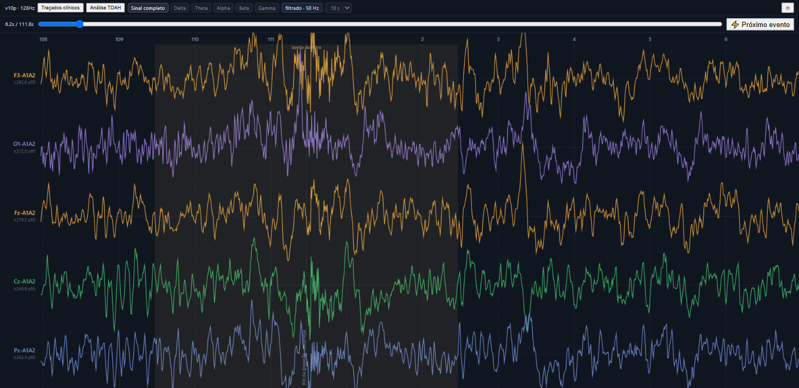

And since the recording plays on a loop, its two ends sit next to each other. There is no step at the seam. the first and last samples are both zero. but the backend filter's **edge transient** is there, and doubled: standard deviation of ~175 in the first and last second against ~127 in the middle. `qc_relatorio.py` discards that band before measuring (`BORDA_S = 2.0`). The viewer shows it and shades it, because hiding signal is worse than labelling it.

## Task events on the time axis

The recording protocol left marks: a voice told the subject to open their eyes at 47.8 s, to close them at 67.8 s, and so on. Those timestamps ship **inside the dataset**. a `_events.tsv` next to every recording, plus an official dictionary at the release root. No scraping involved.

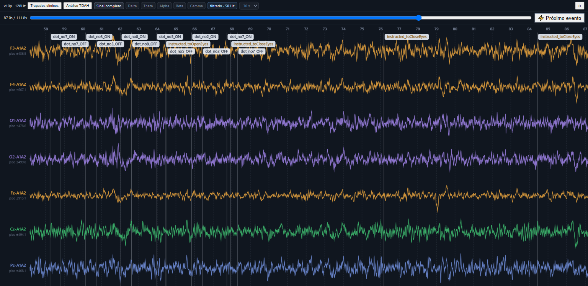

The wizard reads them (`backend/scripts/eventos.py`, exposed as `GET /eventos`) and the trace view draws them as translucent labels anchored to the timestamp, with a thin line running down across the channels. Labels stack across three rows when events crowd together, and any that still would not fit are **dropped rather than truncated**. half a legible word is worse than none. with the count reported in the corner.

> [!NOTE]
> The event list in the wizard is **editable**, and that is not politeness. The `ds005505` dictionary has a copy-paste error: two distinct levels. `instructed_toCloseEyes` and `instructed_toOpenEyes`. share one description, *"A voice prompt instructed subject to open their eyes"*. In `sub-NDARAC904DMU`'s RestingState file (36 events), **5** carry text that is actually wrong: the `toCloseEyes` ones.
>
> The app flags **11**, not 5. That gap is the detector being honest about what it can see: it finds two values collapsed onto one description and has no way to know *which side of the pair* got the wrong text, so it marks the whole pair and reports the collision in `divergencias`. It then shows each event's `value` rather than the suspect description, and lets you fix the label.
>
> `adhdata.csv` has **no events at all**. the dataset was published without stimulus markers, which is exactly why this app computes no ERP components. The wizard says so instead of showing an unexplained empty list.

## The ADHD analysis panels

Four descriptive panels, computed live over the visible buffer. Each carries its own caveat in the interface, because each one deserves one.

<table>
<tr>
<td width="50%">

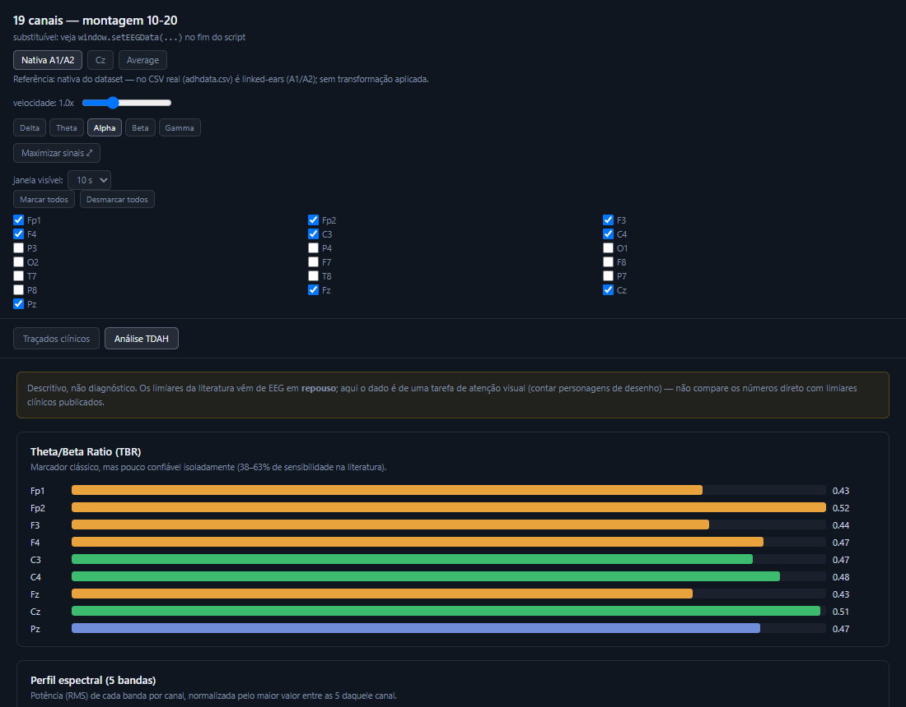

**Theta/Beta Ratio (TBR)**. the classic ADHD marker, per channel. Once FDA-cleared as a diagnostic aid, later walked back: sensitivity in the literature spans a disappointing 38-63%, and it is not reliable in isolation.

</td>
<td width="50%">

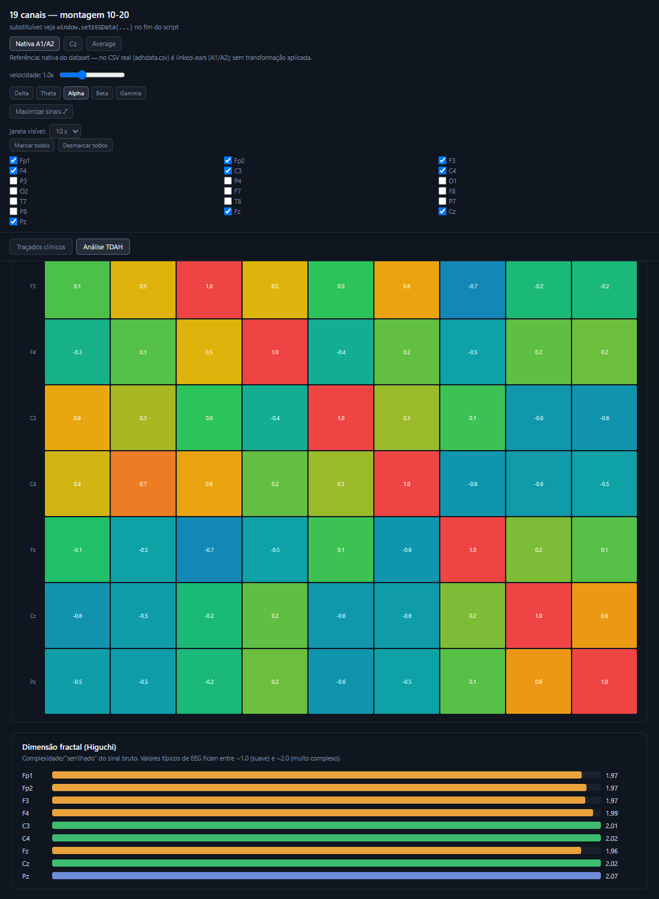

**Synchronization + complexity**. a channel-by-channel correlation matrix for the active band, and Higuchi fractal dimension as a measure of signal complexity (EEG typically lands between ~1.0 and ~2.0).

</td>
</tr>
</table>

Also included: a **5-band spectral profile** (RMS power per band per channel, normalized within each channel).

The panels follow the markers reviewed in *Use of EEG to Diagnose ADHD* ([PMC4633088](https://pmc.ncbi.nlm.nih.gov/articles/PMC4633088/)). The ERP components from that review (P3, N2, ERN, P2, FRN) are deliberately **absent**. they require stimulus-event markers in the time series, and this dataset ships no event column. Rather than fake them, the app omits them.

---

## Architecture

A deliberately small system: one static HTML page for everything interactive, one Python service for the heavy neuroscience, and two data banks behind it.

> [!WARNING]
> **The page is one file, but it is not offline.** `eeg-cerebro-3d.html` loads **three scripts from public CDNs**. `three.min.js` from cdnjs, and `OrbitControls.js` and `OBJLoader.js` from jsDelivr. Without internet access, or behind a firewall that blocks those hosts, everything else still works. traces, filters, re-reference, the analysis panels. but **the 3D brain simply never appears**, and nothing on screen says why. That failure mode looks like a broken app rather than a missing download, which is why it is written here. To run fully offline, save those three files next to the HTML and repoint the three `<script src>` attributes at them.

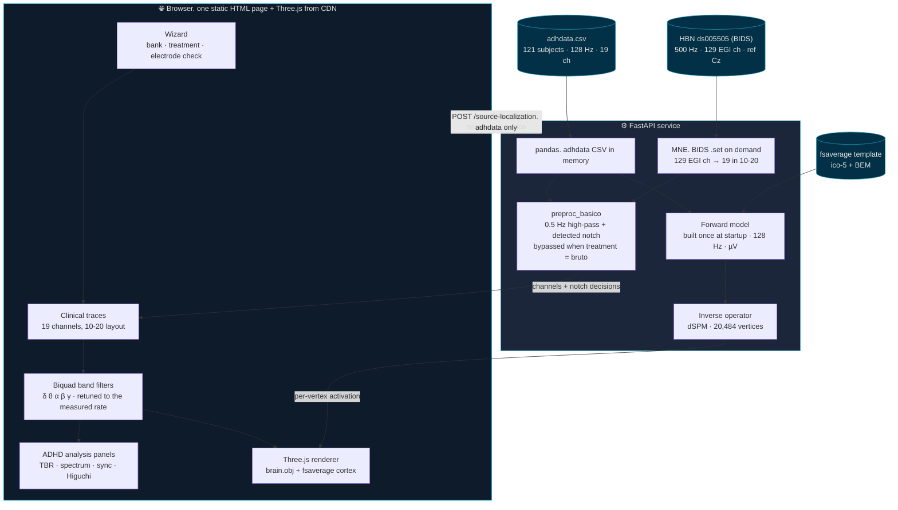

Two banks enter, one shape comes out: whatever the source, the rest of the app reasons in 19 channels named in 10-20, at a rate it was told rather than one it assumed. The preprocessing stage sits on the way out of *both*, and it is bypassed. not silently, but by your choice in the wizard. when the treatment is **bruto**.

### Signal path, from raw sample to colored vertex

The buffer is fed at **the recording's own rate**. one sample per 1/`fs` s step, where `fs` is whatever the wizard measured on the file it opened (128 Hz for `adhdata`, 500 Hz for the HBN). It used to be hard-wired to 128. `configurarTaxa()` is the single place that changes it, and it rewrites the loop clock *and* rebuilds the biquads together, because moving one without the other is exactly what produces a plausible, wrong screen: the trace scrolls at the right speed while the bands lie, or the reverse. Playback at `1.0x` is therefore real time in either case: a 155-second recording takes 155 seconds to play.

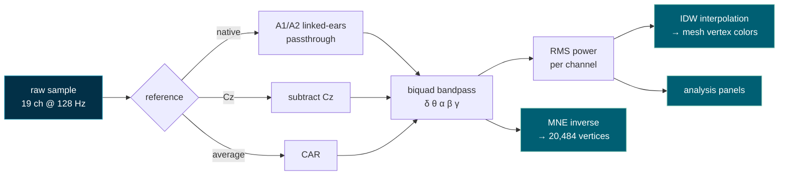

Note the two distinct routes to the 3D view. The **sensor** path (`IDW interpolation`) spreads electrode measurements across the mesh. fast, live, but anatomically naive. The **source** path (`MNE inverse`) solves the physics. slower, snapshot-only, but geometrically meaningful. The app keeps them clearly separate and labels which one you are looking at, because conflating the two is exactly how EEG visualizations mislead.

---

## Getting started

### Requirements

- Python 3.11+
- A modern browser with WebGL
- ~2 GB free disk (the fsaverage template downloads on first run)

### 1. Get the data

`adhdata.csv` is **not in this repository**. it is 255 MB, well past GitHub's file limit. Download it yourself:

> **EEG Data for ADHD / Control Children**. Nasrabadi, Allahverdy, Samavati & Mohammadi (2020)
> [IEEE DataPort](https://ieee-dataport.org/open-access/eeg-data-adhd-control-children) · DOI [10.21227/rzfh-zn36](https://doi.org/10.21227/rzfh-zn36) · also mirrored on [Kaggle](https://www.kaggle.com/datasets/danizo/eeg-dataset-for-adhd/data)

Place `adhdata.csv` in the repository root. Expected columns: the 19 channel names, plus `Class` (`ADHD` / `Control`) and `ID`.

<details>
<summary>A note on channel naming</summary>

The original dataset uses the older labels `T3/T4/T5/T6`. This project uses the modern equivalents `T7/T8/P7/P8` throughout, matching the `standard_1020` montage in MNE. They refer to the same electrode positions.

</details>

### 2. Start everything at once

```bash
python iniciar.py
```

This brings up all three services and opens the app:

| | |
|---|---|
| <http://localhost:8001> | backend (signal, filtering, events) |
| <http://localhost:5500> | the EEG app |
| <http://localhost:8002> | the project map |

`Ctrl+C` stops all of them. Pass `--mapa` to open the project map instead of the app, or `--sem-mapa` to skip it.

If a port is already taken. a backend left running by an earlier session, say. the launcher **says so and reuses what is there** rather than starting a doomed second copy. It used to start one anyway, watch it die one second later, and print `backend caiu` while killing the frontend and the map that were both working fine. It also waits for each service to actually answer before opening the browser: the backend loads a 267 MB CSV and builds the source model, and opening the page before that shows an empty screen that looks like a bug.

The sections below describe starting each service by hand, which is what you want when one of them is misbehaving.

### 3. Start the backend

```bash
cd backend
pip install -r requirements.txt
python -m uvicorn app:app --port 8001
```

> [!NOTE]
> **Port 8001 is not optional.** The frontend has the backend URL hardcoded (`BACKEND_URL` in `eeg-cerebro-3d.html`). Serve it on any other port and the subject list stays empty and source reconstruction never runs. change the constant if you need a different port.

First startup takes a few minutes: it downloads the fsaverage template and builds the forward and inverse operators. Subsequent runs are fast. everything is cached. Wait for:

```
[startup] forward/inverse prontos: 20484 vértices, 19 canais
```

### 4. Serve the frontend

```bash
python -m http.server 5500
```

Open <http://localhost:5500/eeg-cerebro-3d.html>.

> The backend only accepts requests from `localhost` / `127.0.0.1`. Open the page through the HTTP server. not as a `file://` URL. or the browser will block the calls.

<details>
<summary>Running the tests</summary>

```bash
cd backend
python -m pytest tests/
```

</details>

---

## Surveying a HBN-EEG release

Two offline scripts in `backend/scripts/` survey an [HBN-EEG](https://openneuro.org/datasets/ds005505) release before any of it is used for analysis. They answer the two questions that decide whether a release is usable at all: *what is actually on disk*, and *can it be labelled*.

The full ds005505 is **103 GB** (136 subjects, 129 channels, 500 Hz). Download selectively. metadata first, then only the subjects and task you need.

> [!IMPORTANT]
> **Download it where the app looks for it.** `backend/config.py` is the only module that knows where data lives, and it looks for a release under `RAIZ_DADOS/<accession>`. that is **`C:\dados\hbn\ds005505`** by default, or `<EEG_DADOS>/ds005505` if you set the `EEG_DADOS` environment variable. Anywhere else and the wizard lists the bank as unavailable, printing the path it wanted. after you have moved 103 GB into the wrong folder. The data stays outside the repository on purpose: two projects consume the same recordings, and nothing this large belongs in git.

```python
import pandas as pd, openneuro as on
# RAIZ_DADOS/<accession>. the path config.caminho_release() will look in.
# Set EEG_DADOS first if you want the releases somewhere other than C:\dados\hbn.
alvo = r"C:\dados\hbn\ds005505"

# metadata only. a few MB. participants.tsv always comes along.
on.download(dataset="ds005505", target_dir=alvo, include=["/*.json", "/*.tsv"])

p = pd.read_csv(rf"{alvo}\participants.tsv", sep="\t")
sel = p[(p.RestingState == "available") & p.p_factor.notna()].participant_id.head(10)

on.download(dataset="ds005505", target_dir=alvo,
            include=[f"{s}/eeg/*task-RestingState*" for s in sel])
```

```bash
cd backend
python scripts/fenotipo_hbn.py  C:/dados/hbn/ds005505/participants.tsv
python scripts/inventario_hbn.py C:/dados/hbn/ds005505
```

| Script | Output | Answers |
|---|---|---|
| `fenotipo_hbn.py` | `relatorios/fenotipo_hbn.txt` | age, gender and the four psychopathology dimensions, plus how many subjects are missing each field |
| `inventario_hbn.py` | `relatorios/inventario_hbn.csv` | one row per (subject, task): duration, sampling rate, channel count, `events.tsv` presence |

> [!NOTE]
> **What the HBN needed, and the one thing it still does not get.** The release records at 500 Hz with 129 EGI channels named `E1…E128`, referenced to Cz. The app no longer assumes 128 Hz and the 19 `Fp1/Fp2/…` names: the wizard measures the rate off the file and `configurarTaxa()` retunes the clock and the biquads to it, and `/raw-data` reduces 129 channels to the 19 analysis channels **in the backend**, translated through the manufacturer's official EGI→10-20 map (`config.MAPA_EGI_1020`) and confirmed by you on a drawn head rather than on a list of names.
>
> What does **not** cover the HBN is **source reconstruction**. The forward and inverse operators are built once at startup from a 128 Hz `info` in µV, so `POST /source-localization` returns a 400 explaining itself for any bank other than `adhdata`. dSPM is normalised, so it would have returned a plausible-looking map with nothing on screen to denounce it. refusing is the honest answer until the model is built per bank.

The HBN phenotype offers **four continuous dimensions** (`p_factor`, `attention`, `internalizing`, `externalizing`), not a diagnosis. A binary ADHD label only comes from thresholding `attention`. a methodological choice that has to be declared, not buried in code.

The inventory never aborts: an unreadable `.set` becomes a row with its `erro` column filled and the sweep continues, because the point of the survey is the complete map, holes included.

---

## Preprocessing: high-pass, notch, and the proof it worked

The app's **default** treatment is still raw signal, and the [Limitations](#limitations-read-this-part) table says what that costs. Two files in `backend/scripts/` are what change that when you ask them to: `preproc_basico.py` applies the first two corrections. and the API *imports* it, so choosing **básico** in the wizard runs this exact code, not a copy of it. while `qc_relatorio.py` does the part that matters just as much: it **measures whether they worked**.

```bash
cd backend
python scripts/preproc_basico.py ../adhdata.csv v10p      # or a .set from the HBN
python scripts/qc_relatorio.py   ../adhdata.csv v10p      # or a whole BIDS root
```

`preproc_basico.py` applies a 0.5 Hz high-pass and then a notch. **in that order**, because a large DC offset makes the notch's edge transient last longer and contaminate more samples.

### The mains frequency is measured, not assumed

`adhdata.csv` carries 50 Hz interference; the HBN was recorded in New York, where the mains run at **60 Hz**. Hard-coding either number is the kind of detail that turns into a silent bug the moment the pipeline moves between datasets. the notch would miss the interference entirely *and* punch a hole in the middle of the gamma band.

So the frequency comes from the spectrum. The same code, unchanged, on the two datasets:

| Dataset | Detected | Peak-over-neighbourhood | Note |
|---|---|---|---|
| `adhdata.csv` @ 128 Hz | **50 Hz** | 38.7 dB | only candidate below Nyquist. flagged as won-by-elimination |
| HBN ds005505 @ 500 Hz | **60 Hz** | 46.0 dB | 45.2 dB margin over 50 Hz |

The HBN's own BIDS sidecar independently declares `"PowerLineFrequency": 60`, which is a pleasant confirmation rather than the source.

Detection refuses to guess. It returns *no frequency*. and says which of three reasons. when there is no peak at all (the data was already notched, and notching blind would destroy neural signal for free), when two candidates are equally strong, or when Nyquist doesn't cover them. One of the ten HBN subjects came back `sem_pico_de_rede`, and got no notch.

### The report is the evidence

`qc_relatorio.py` **imports** `preproc_basico` rather than reimplementing the filters, so what it measures is the pipeline that actually runs. Measured on `adhdata.csv`:

| Metric | Before | After |
|---|---|---|
| Channel mean | 152.56 | 0.24 (0.16% residual) |
| Delta fraction (1-4 Hz) | 0.608 | 0.608 |
| Mains ratio @50 Hz | +38.23 dB | −0.16 dB |
| Alpha power preserved | 1.000 | 1.000 |

Two of those rows deserve a word:

**Alpha preserved is the metric people forget.** A filter that zeroes the mean and kills the alpha rhythm along the way passes every other check and has destroyed the recording. Without measuring it, the report would claim success without having verified the one thing the filter was not allowed to do.

**The delta fraction is reported, not graded.** The high-pass cuts at 0.5 Hz, so it only drops delta when the power there was drift leaking up from below. In `adhdata.csv` the spectrum above 1 Hz is *identical* before and after. that energy is real delta activity, and the filter is right to leave it alone. What proves the DC came out is the channel mean.

The mean is judged proportionally rather than against a fixed threshold in µV. That matters for the HBN, where a subject goes from 193,893 to 0.5. a 99.9997% reduction that any absolute "under 1 µV" limit would fail. Filters are linear and don't care about scale; thresholds do.

> [!NOTE]
> **A correction to an earlier version of this section.** It used to conclude, from that 99th percentile of ≈136,000, that the HBN sits on "an uncalibrated amplifier scale". The evidence does not support that. The 99th percentile of the *raw* signal is dominated by DC offset, not by EEG amplitude: after treatment the HBN's peak is **76.9** against `adhdata`'s **1240.3**, sixteen times *smaller* and well inside the physiological range. The parsimonious reading is microvolts with a large DC offset. What honestly stands is that **the calibration is unconfirmed**, which is why figures for the HBN label their axis "un. do arquivo" rather than µV.

### One subject fails, and that is in here on purpose

Run the report over `sub-NDARAC904DMU`. the same subject the figures use. and the mains row comes back **FAILED**: 45.02 dB before, 6.20 dB after, against a 3 dB threshold. The figures in the companion notebook report 0.27 dB for the same subject at the same frequency.

Both numbers are right, and the difference is not noise: `qc_relatorio.py` calls `preprocessar` with the app's default. high-pass plus notch, **no low-pass**. because that is what the app applies to the trace you look at. The figures apply all four steps. The 45 Hz cutoff takes another 6 dB out at 60 Hz, and that is the whole gap.

The threshold is not wrong. It is saying that **the notch alone is not enough** for this subject, and that belongs in the README rather than behind the more flattering figure.

Finding this also exposed a defect in the report itself: the per-subject table printed FAILED while the summary six lines below printed "no metric failed". The metrics come out of numpy, and `numpy.bool_(False) is False` evaluates to *false*. the filter for failures used `ok is False` and saw nothing. Fixed at the source (`bool()`) and in the filter (`ok is not None and not ok`), locked by `test_veredito_reprovado_aparece_no_resumo`. A quality report whose summary is never checked against its own rows is a report that only knows how to approve.

---

## The project map

`http://localhost:8002` serves a second, unrelated thing: a flowchart of the whole master's, read from the Obsidian vault and from this repository.

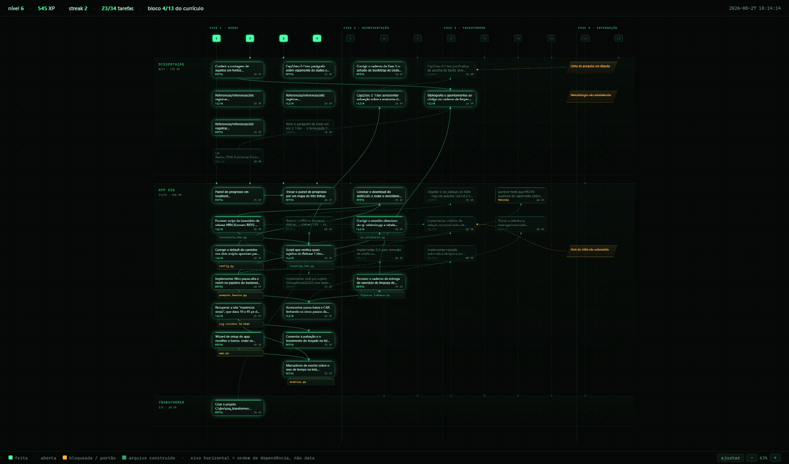

Three horizontal lanes, one per track. **The horizontal axis is dependency order, not time**: a task's column is the longest path to it through the graph, so everything to its left has to happen first. Above the lanes sits the curriculum spine. 13 blocks in 4 phases, lit when done. and each block drops a dotted line into every track it touches.

Below a finished task hangs the file it built, colored by what is actually on disk: **green** the script exists *and* its artifact is there, **amber** the script exists but never ran, **red** the file is missing. The amber diamonds on the right are blockers that are not tasks at all (research line in dispute, methodology not established, HBN data use agreement not submitted). without them the map would claim that only code is missing, which is false.

There is no prose on the page. Click any node and the detail opens on the right:

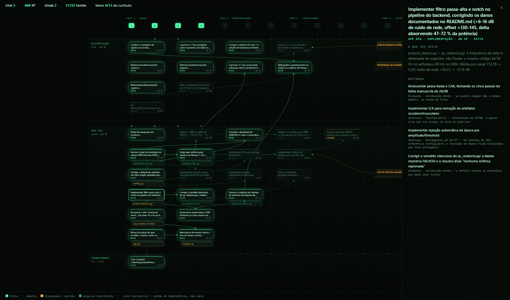

### Where the arrows come from

This is the part worth knowing before trusting the picture. The vault has **exactly one machine-readable dependency in it**. `Tarefas.md:54`, a `🔒 bloqueada por:` marker. Everything else was prose, in four different dialects, spread across `Tarefas.md`, `Rota.md` and `Entregaveis.md`.

So the edges are **declared in `backend/scripts/grafo.py`**, and every one of them carries the `file:line` of the vault text it came from. Where a link is my judgement rather than a citation, the source says `atribuição minha`. a different status, shown as a different status.

That arrangement can drift, and one test exists to catch it: `test_toda_aresta_resolve` requires both ends of every declared edge to still match a real task. Rename a task in the vault and the suite fails naming the orphan, instead of the arrow quietly vanishing from the drawing.

The one thing that is **not** declared: the links *between* tracks. `Curriculo.md` turned out to have real structure. 13 blocks whose `**Trilha:**` field is multi-valued in 7 of them. so those edges are derived from data, with nothing written by hand.

```bash
cd backend
python scripts/painel_progresso.py            # serves on 8002
python scripts/painel_progresso.py --json     # just the state, no server
python scripts/grafo.py                       # resolve the graph, report orphans
```

It keeps no state of its own. every load re-reads the files. Point `EEG_VAULT` at your Obsidian vault root if it lives somewhere other than `C:\Obsidian\MESTRADO_ITA`; without it, the map reports why it is empty rather than drawing nothing.

## API

Seven routes. `dataset_id` defaults to `adhdata` where it is optional and is **required** on the wizard routes, because "which bank" is not a question the server should answer by guessing.

| Endpoint | Method | Purpose |
|---|---|---|
| `/datasets` | `GET` | Every bank the app knows, with `disponivel` and. when false. the path it looked in. Unavailable banks are listed, not hidden |
| `/dataset-config?dataset_id=&subject_id=` | `GET` | What the app *measured* off the bank and how it will configure itself for it. the wizard's confirmation step. Blocks only on a real pipeline limit; signal that merely disagrees with the bank's own documentation passes with a warning |
| `/subjects?dataset_id=` | `GET` | The subjects of one bank. `classe` and `duracao_s` come filled **only for `adhdata`**. for the HBN both are `null`, because knowing them would mean opening every `.set` before the selector can appear |
| `/eletrodos?dataset_id=&subject_id=` | `GET` | Every electrode in the recording with its 3D position, plus the suggested 10-20 correspondence and where that map came from. all 129 channels, not just the 19 chosen |
| `/eventos?dataset_id=&subject_id=` | `GET` | Task events, with `divergencias` for dictionary collisions. An empty list always carries a `motivo`: "this bank has no stimulus markers" and "something failed" must not look alike |
| `/raw-data?subject_id=&dataset_id=&preproc=` | `GET` | The full recording, per channel, in 10-20 names. `preproc` is `nenhum` (default) or `basico`; `fs`, `unidade` and `amplitude_p99` travel with the data so the frontend does not have to assume any of them, and `basico` also returns which mains frequency was detected and which harmonics came out |
| `/source-localization` | `POST` | Source reconstruction for a time window. **`adhdata` only**, 400 with an explanation otherwise |

```jsonc
// POST /source-localization
{ "subject_id": "v10p", "t_start": 0.0, "t_end": 2.0, "method": "dSPM", "dataset_id": "adhdata" }

// → 200
{ "values": [/* one per vertex */], "n_vertices": 20484, "time": 0.0, "method": "dSPM" }
```

---

## Limitations (read this part)

Honesty about what a tool *cannot* do is what makes it usable in a scientific context. These caveats appear inside the interface too, next to the numbers they qualify. not buried in a document nobody opens.

**Nineteen channels is few for source localization.** Research-grade source reconstruction uses 64, 128, or 256 electrodes. With 19, the inverse problem is severely underdetermined: the output is a plausible smooth estimate, not the true origin of the signal. Treat a hotspot as a *region of interest*, never as a coordinate.

**fsaverage is a template brain.** Every reconstruction is projected onto an average anatomy, not the individual child's. Without that subject's MRI, per-subject anatomical accuracy is simply unavailable.

**The literature thresholds do not transfer.** Published TBR cutoffs come from **resting-state** EEG. This dataset was recorded during an active visual attention task (children counting cartoon characters). Comparing these numbers against resting-state thresholds is an apples-to-oranges error.

**The synchronization matrix is a correlation, not coherence.** It correlates band-filtered signals in the time domain. That is a useful, cheap proxy. but it is not magnitude-squared coherence, and should not be reported as such.

**No ICA, and no artifact rejection.** This used to read "no preprocessing at all", and that is no longer true: the 0.5 Hz high-pass and the notch at the *measured* mains frequency are implemented, run in the backend (`preproc_basico.py`), are reachable from the wizard's **básico** treatment and from `GET /raw-data?preproc=basico`, and carry the before/after evidence [shown above](#the-report-is-the-evidence).

What is absent is everything that comes *after* those two steps: **no ICA**, no epoch rejection, no bad-channel interpolation, no automatic exclusion of the artifacts the ⚡ event finder locates. And the wizard's default treatment is still **bruto**. the signal exactly as it left the amplifier. so unless you chose otherwise, that is what the numbers on screen describe. A spectral analysis of the dataset in that raw state shows what it costs:

| Finding | Measured | Consequence |
|---|---|---|
| **50 Hz mains interference** | +6 to +16 dB above the alpha peak | No notch filter was applied when recording; the line frequency is among the strongest components in the signal |
| **DC offset and drift** | channel means of +130 to +145 instead of 0 | Delta absorbs 47-72% of total power, much of it drift rather than neural activity |
| **Amplitude** | 99th percentile of 500-1200 µV | 10-20× physiological EEG; the recordings carry substantial artifact, and the unit scaling is not verified |

A rigorous pipeline would apply a high-pass around 0.5 Hz, a notch at the mains frequency, and ICA-based artifact removal before any of the band measurements shown here. The first two are in. the third is not. Read the band numbers as *descriptive of the signal in the treatment you selected*, and check which treatment that is before quoting one.

**Eye blinks, muscle tension, and electrode drift** survive the high-pass and the notch. they are broadband and in-band, which is precisely why ICA exists. The ⚡ event finder locates the worst of them, but nothing removes them.

**Ad-hoc noise covariance.** With no empty-room or baseline recording in the dataset, the inverse operator uses a diagonal ad-hoc covariance. a reasonable default, and a real approximation.

> [!WARNING]
> **Not a diagnostic instrument.** ADHD is a clinical diagnosis made by a qualified professional through history, observation, and validated instruments. EEG is not a standalone diagnostic test for it, and no number this software displays should be presented to a patient or family as evidence of a diagnosis.

---

## Acknowledgments

This project is built on the work of people who gave their tools away, and it would not exist otherwise.

**[MNE-Python](https://mne.tools)**. the entire source reconstruction pipeline is theirs: forward modeling, BEM handling, the inverse operators, and the fsaverage template that ships ready to use without a FreeSurfer installation. It is a remarkable piece of open scientific software, and the reason a project this small can do real source analysis at all. Deep thanks to its maintainers and contributors.

**Nasrabadi, Allahverdy, Samavati & Mohammadi**. for publishing their ADHD/control EEG recordings as open access. Public datasets are what make independent work like this possible.

**[Three.js](https://threejs.org)**, **[FastAPI](https://fastapi.tiangolo.com)**, **[pandas](https://pandas.pydata.org)**, and **[NumPy](https://numpy.org)**. the rest of the foundation.

### Citing the tools

If this work contributes to something you publish, please cite MNE-Python and the dataset:

```bibtex
@article{gramfort2013mne,
  title   = {MEG and EEG data analysis with MNE-Python},
  author  = {Gramfort, Alexandre and Luessi, Martin and Larson, Eric and
             Engemann, Denis A. and Strohmeier, Daniel and Brodbeck, Christian and
             Goj, Roman and Jas, Mainak and Brooks, Teon and Parkkonen, Lauri and
             H{\"a}m{\"a}l{\"a}inen, Matti},
  journal = {Frontiers in Neuroscience},
  volume  = {7},
  pages   = {267},
  year    = {2013},
  doi     = {10.3389/fnins.2013.00267}
}

@data{nasrabadi2020eeg,
  title     = {EEG data for ADHD / Control children},
  author    = {Nasrabadi, Ali Motie and Allahverdy, Armin and
               Samavati, Mehdi and Mohammadi, Mohammad Reza},
  publisher = {IEEE Dataport},
  year      = {2020},
  doi       = {10.21227/rzfh-zn36}
}
```

---

## Repository

**<https://github.com/murilomn58/EEG_app>**

Issues and pull requests are welcome. particularly around artifact rejection, additional inverse methods (sLORETA, eLORETA), and per-band source reconstruction.

<details>
<summary>Project layout</summary>

```
├── eeg-cerebro-3d.html      # the whole frontend in one file. except Three.js, from CDN
├── iniciar.py               # starts backend + frontend + map, waits for each to answer
├── backend/
│   ├── app.py               # FastAPI routes + startup lifecycle
│   ├── config.py            # the only module that knows where data lives (EEG_DADOS)
│   ├── csv_data.py          # adhdata loading and time-window slicing
│   ├── canais.py            # analysis channel names → this bank's channel names
│   ├── eletrodos.py         # electrode 3D positions for the confirmation screen
│   ├── verificar_referencia.py  # infers a file's reference from per-channel statistics
│   ├── mne_setup.py         # forward model + inverse operator
│   ├── mne_infer.py         # applies the inverse solution
│   ├── export_fsaverage_mesh.py # run once: fsaverage cortex → .obj + vertex indices
│   ├── scripts/             # part offline tooling, part imported by the API
│   │   ├── eventos.py           # task events → GET /eventos          ← imported by app.py
│   │   ├── preproc_basico.py    # high-pass + detected notch          ← imported by app.py
│   │   ├── qc_relatorio.py      # before/after evidence that the filters worked
│   │   ├── inventario_hbn.py    # walks a BIDS release → one row per (subject, task)
│   │   ├── fenotipo_hbn.py      # participants.tsv → phenotype distributions
│   │   ├── figuras_limpeza.py   # the signal-cleaning figures
│   │   ├── grafo.py             # task dependencies, each with the vault line it came from
│   │   └── painel_progresso.py  # the project map, served on 8002
│   └── tests/               # pytest suite
├── assets/                  # brain.obj + fsaverage cortex mesh
├── relatorios/              # generated reports (inventory, phenotype, QC)
└── docs/                    # design notes, implementation plan, images
```

`scripts/` is **not** offline-only, and calling it that hid a real coupling: `app.py` puts the folder on `sys.path` and imports `eventos` and `preproc_basico` from it, so `/eventos` and `/raw-data?preproc=basico` are those two files. The other six run from the command line. The advantage of the arrangement is that `qc_relatorio.py` measures the same `preproc_basico` the API serves. the report cannot drift from the pipeline, because there is only one.

</details>

> **Language:** the interface **and the codebase** are in Brazilian Portuguese. identifiers, comments and docstrings included. This documentation is the part that is in English.

---

## Data attribution and licensing

This repository ships **no recordings**. It reads two public banks, and each one
comes with its own terms. different terms. Attribution here is not a courtesy:
one of the two releases requires it in writing, by name, with two DOIs.

### HBN-EEG, release 1 (`ds005505`)

The EEG section of the **Healthy Brain Network** project.
It is run by the **Child Mind Institute**, and curated into BIDS.

| | |
|---|---|
| **Dataset** | Healthy Brain Network (HBN) EEG. Release 1 |
| **Dataset DOI** | `doi:10.18112/openneuro.ds005505.v1.0.1` |
| **License** | **CC-BY-SA 4.0** |
| **Ethics approval** | Chesapeake Institutional Review Board |

**Authors**, exactly as the release lists them in `dataset_description.json`:
Seyed Yahya Shirazi, Alexandre Franco, Maurício Scopel Hoffmann, Nathalia B.
Esper, Dung Truong, Arnaud Delorme, Michael Milham, Scott Makeig.

The release states how it wants to be acknowledged, and it asks for **two**
citations, not one:

> Please cite the dataset paper (<https://doi.org/10.1101/2024.10.03.615261>) as well as the original HBN publication (<https://dx.doi.org/10.1038/sdata.2017.181>).

Both DOIs go in your references if anything you publish touched this bank through
this app. And `CC-BY-SA` is share-alike: a derivative of the *data* inherits the
license. The MIT license below covers the code in this repository, and only the
code. it does not relicense a single sample.

> [!NOTE]
> The releases are not uniform. The eleven numbered releases are CC-BY-SA 4.0;
> the one labelled **NC** is CC-BY-NC-SA-4.0 and prohibits commercial use.
> Everything measured in this README came from `ds005505`. release 1, 136
> subjects. and says nothing about the other ten.

### adhdata

| | |
|---|---|
| **Dataset** | EEG data for ADHD / Control children |
| **Authors** | Nasrabadi, Ali Motie; Allahverdy, Armin; Samavati, Mehdi; Mohammadi, Mohammad Reza (2020) |
| **Publisher** | IEEE DataPort |
| **DOI** | [10.21227/rzfh-zn36](https://doi.org/10.21227/rzfh-zn36) |
| **License** | **not confirmed**. read on |

**The license of this one could not be confirmed.** The IEEE DataPort page gives
the authors, the creation date and the DOI, and labels the dataset *open access*
behind a free account. but it states **no license**: no Creative Commons
variant, no terms-of-use text (page read on 2026-08-28). So this README does not
name one. What holds regardless: cite the authors and the DOI. the BibTeX in
[Citing the tools](#citing-the-tools) has both. and read IEEE DataPort's terms
for the account you download it with before redistributing anything derived from
it. An absent license is not a permissive license.

### What this data actually is

Both banks are **EEG recordings of children and adolescents, each one attached to
a psychiatric label**. `adhdata` is 121 children, every row carrying `ADHD` or
`Control` next to the subject `ID`. HBN release 1 is 136 participants aged 5.2 to
21.7 years, and `participants.tsv` carries four continuous psychopathology
dimensions derived from the CBCL. `p_factor`, `attention`, `internalizing`,
`externalizing`. This is health data about minors. It is not a demo file, and the
fact that it downloads with one command does not make it one.

What that means in practice for anyone who clones this repository:

- **The data does not come with the clone.** Neither bank is in this tree and neither is fetched for you. You download each one yourself, under your own account and your own agreement with the provider, and it stays outside the repository: `adhdata.csv` is in `.gitignore`, and the HBN releases live under `C:\dados\hbn` (or `$EEG_DADOS`), which `backend/config.py` points at without ever writing inside it.
- **The app serves on `127.0.0.1` and nowhere else.** `iniciar.py` binds the frontend with `--bind 127.0.0.1`, the backend runs on uvicorn's loopback default, and the backend's CORS rule only accepts origins matching `http://(localhost|127\.0\.0\.1):\d+`. That is deliberate: the frontend server publishes the *whole project root*, so on `0.0.0.0` it hands out any recording sitting in it, to anyone on the Wi-Fi, without authentication. Do not "just add `--host 0.0.0.0`" to make it reachable from another machine.
- **The generated reports carry the subject identifier.** `relatorios/inventario_hbn.csv` has one row per (subject, task) keyed by `sub-NDAR…`, and `relatorios/qc_relatorio.txt` names the subject file in its header. Only `relatorios/fenotipo_hbn.txt` is purely aggregate. The whole folder is in `.gitignore`, so a normal `git push` does not carry it. but a zip, a screenshot, a Drive folder or an email attachment will.
- **None of this is anonymization.** The pseudonymous IDs come from the providers and travel through this app untouched; nothing here hashes, salts, strips or aggregates them, and the app never had a step that claimed to.

This is a description of what the repository **does**. it is not legal advice and
not a compliance assessment against any data-protection regime. What the
repository actually guarantees is narrow: a loopback bind, a `.gitignore` entry, and a
backend with exactly one write-shaped route (`POST /source-localization`, which
computes and returns. it stores nothing and sends nothing anywhere). What it does **not** guarantee is that your use of
these recordings is lawful where you are, that an ethics approval covers it, that
the subject IDs in `relatorios/` are safe to share, or that anything you export
from the screen is de-identified. Those decisions belong to you and to your ethics
board, not to this README.

---

## License

MIT. see [LICENSE](../LICENSE).

The datasets are **not** covered by it. **Both** banks carry their own terms, and
they are not the same terms: HBN-EEG `ds005505` is CC-BY-SA 4.0 and requires the
two citations named above, while `adhdata` comes from IEEE DataPort with no
license stated on its page. See [Data attribution and licensing](#data-attribution-and-licensing).


